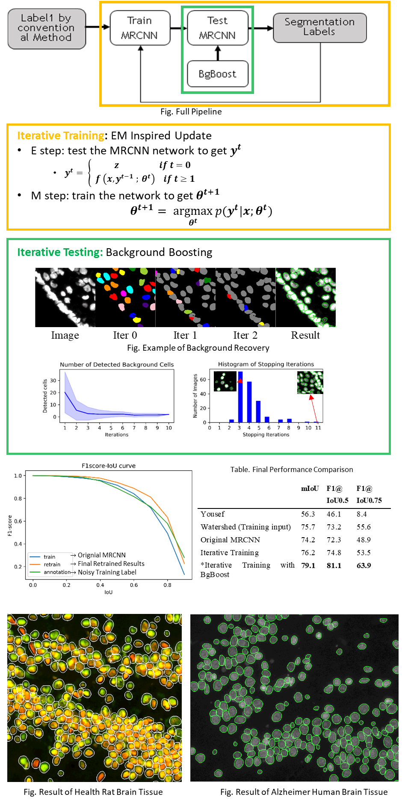
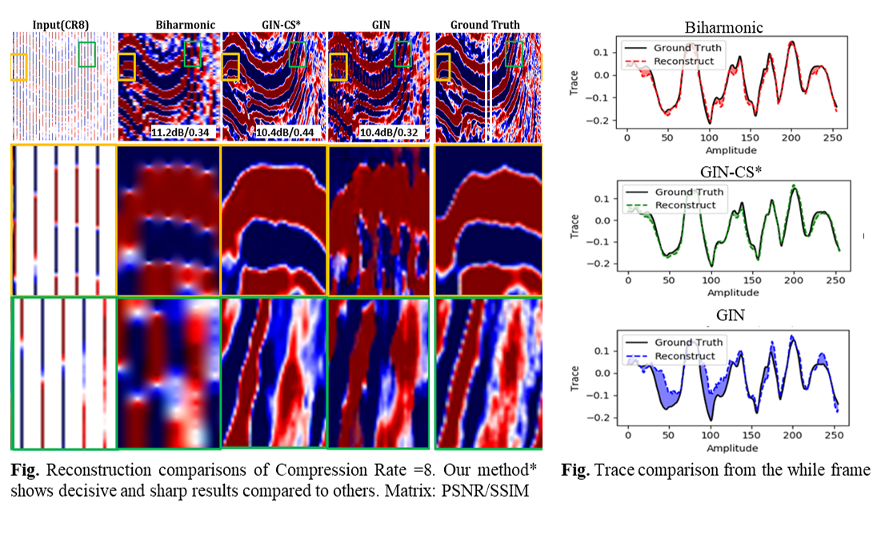
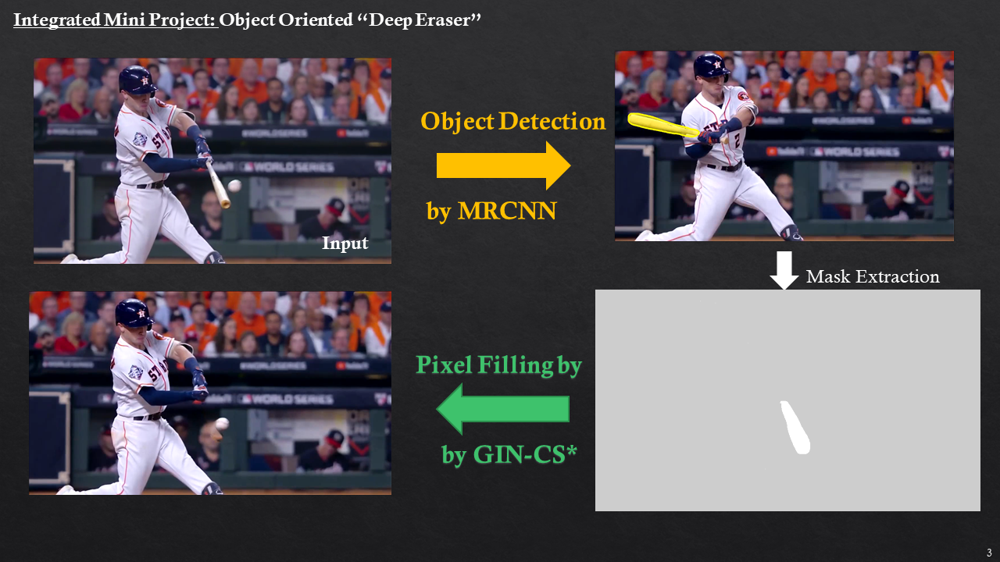
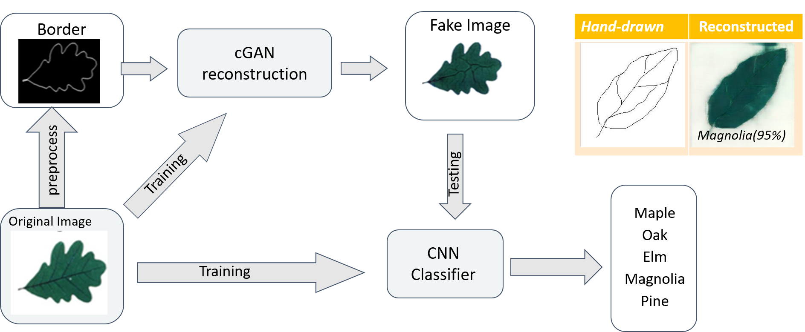
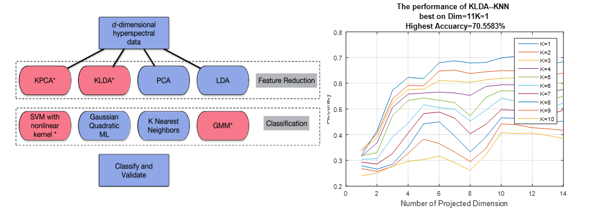
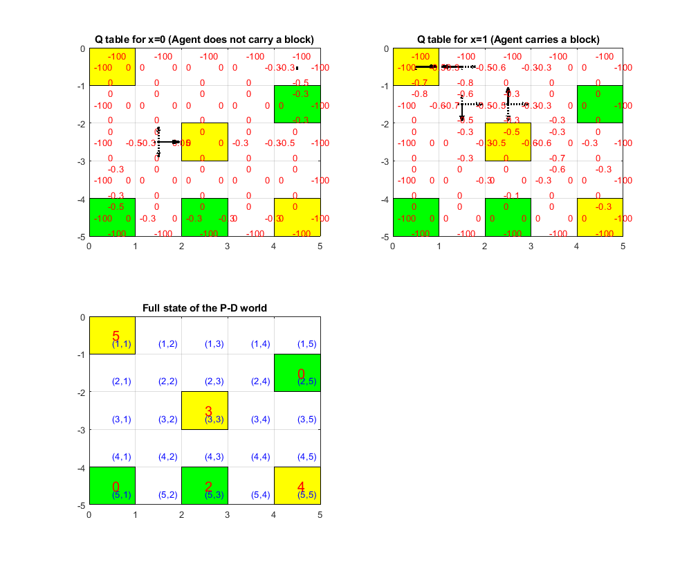

Howdy, I am Rebecca Li, a Ph.D. at University of Houston with 5-yr experienced Data Scientist. I have published in top-tier AI conferences (NIPS, MICCAI) and Journals on Deep Learning, Machine Learning, and Computer Visions. My diverse advanced industrial domain experience includes Medical Image, Self-driving Car and Oil & Gas. I have greet impassion on solving real-world problem.

- E-mail:   [Xiaoyang.Rebecca.Li@gmail.com](Xiaoyang.Rebecca.Li@gmail.com)    
- [Resume](https://drive.google.com/file/d/1GApBS2kuk6vfx0mnKjPG59URymvI3xze/view) \|  [LinkedIn](http://linkedin.com/in/xiaoyang-rebecca-li) \| [ ResearchGate](http://researchgate.net/profile/Xiaoyang_Li14) \| [ GitHub](http://github.com/Xiaoyang-Rebecca ) 

--------------
# PROFESSIONAL PROJECTS
--------------
## 0-annotation Segmentation 

We innovatively proposed an efficient unsupervised learning framework to segment nuclei robustly without the need of human annotations. We first use an iterative training process to improve segmentation quality without human labels. Then we introduce a background boosting technique to enhance the segmentation accuracy. We achieved high fidelity segmentation especially among crowed objects, and IoU improved by 3% compared to original MRCNN

- Advisors: Badri Roysam, Hien Nguyen
- Datail: [[Grace Hopper Celebration 2020 Poster]](https://www.researchgate.net/publication/342663998_Toward_Zero_Human_Efforts_Iterative_Training_Framework_for_Noisy_Segmentation_Label "Grace Hopper Celebration Poster"),[[Python]](https://github.com/RoysamLab/whole_brain_analysis) (Keras), partically released

--------------
## Compressive Image Recovery 

Seismic image acquisition can be time and economic costs. We adopted an appropriately designed Wasserstein generative adversarial network on compressed seismic image recovery. We first trained a pixel inpainting network on several historical surveys, and then propose a non-uniform sampling recommendation based on the evaluation of reconstructed seismic images and metrics. Our results show approximately 300 times faster than the conventional method, and better seismic reconstruction accuracy than the original GAN network.

- Mentors:  Nikolaos Mitsakos, Ping Lu
- Detail: [[NIPS 2019 Workshop Poster]](https://openreview.net/forum?id=Hyleh7hqUH) , [[The leading Edge Jornal]](https://www.researchgate.net/publication/337686701_Seismic_compressive_sensing_by_generative_inpainting_network_Toward_an_optimized_acquisition_survey) 
- PythonCode(Pytorch) 

--------------
# RELATED PROJECTES
--------------
## Deep Eraser

I designed an object-oriented "eraser" for image and video , which is able to remove the pixels with designated type. MRCNN is used to dected the pixel of a specific types then WGAN is used to remove the detect pixels as they never exist. 

*This is just a prototype use COCO pretrained weights without any additional training.

- Demo for Video

- [[PythonCode]](https://github.com/Xiaoyang-Rebecca/DeepEraser)

## Pixel Translator 

We use cGAN to fillin the synthetic colors on gray images of border/vein. And evaluated the reconstruction accuracy by leaf types classification using Alexnet CNN
Protopytpe of generate fake image from hand-drawn vein has also been proposed.

-[[Report]](https://www.researchgate.net/publication/343178751_Synthetic_Leaf_generation_using_Conditional_Adversarial_Networks_and_classification_with_CNN), [[PPT]](https://www.researchgate.net/publication/325156994_Synthetic_Leaf_generation_using_Conditional_Adversarial_Networks_and_classification_with_CNN?ev=project),[[PythonCode]]("https://github.com/Xiaoyang-Rebecca/PixelTranslator")(Tensorflow)

## Feature Reduction to Classifiers

The case study revealed the influence of 4 common feature redution methods (PCA,LDA and their kernel versions) to 4 diffenrent types of classifier (SVM, ML, KNN, GMM). Our experiments shows that SVM performed the most robust to the increasing of dimensional space, and SVM and LDA are more sensitive to noises.

- [[Report]](https://www.researchgate.net/publication/308927930_Comparison_of_Feature_Reduction_Approaches_and_Classification_Approaches_for_Pattern_Recognition), [[MatlabCode]]("https://github.com/Xiaoyang-Rebecca/PatternRecognition_Matlab")

## Pick-up Drop-off Design

We use reinforcement learning to design a route from the agent so that it could use the least steps to send all the blocks to drop-off cells. A basic Q learning method has deploit. We also designed a  visulization module to display the Q values in real-time.

- [[Report]](https://www.researchgate.net/publication/310607210_Learning_Paths_from_Feedback_Using_Q-Learning_for_PD_world), [[C++/matlab code]]("https://github.com/Xiaoyang-Rebecca/Artificial-intelligent")

--------------
# PRESENTATIONS 
--------------
-	**X. Rebecca. Li**, B. Roysam,. Van Nguyen, H., “Toward Zero Human Efforts: Iterative Training Framework for Noisy Segmentation Label”, Grace Hopper Celebration, General Poster, 2020 [[Poster]](https://www.researchgate.net/publication/342663998_Toward_Zero_Human_Efforts_Iterative_Training_Framework_for_Noisy_Segmentation_Label "Grace Hopper Celebration Poster")
-	B.Roysam, H. Nguyen, S.Prasad , J,Jahanipour, **X, Li**.  et al. “Brain Tissue Analytics for Accelerating Drug Discovery”, 2019 Rice Data Science Conference [[Abstract]](https://2019datascienceconference.sched.com/speaker/xiaoyang_li.2019apwp)
-	 **X. Rebecca. Li.**, et al.. Generative Inpainting Network Applications on Seismic Image Compression and Non-Uniform Sampling. Workshop on Neural Information Processing Systems (NIPS): Solving Inverse Problems with Deep Networks (2019). [[Poster]](https://www.researchgate.net/publication/342393127_Generative_Inpainting_Network_Applications_On_Seismic_Image_Compression?_sg=NLR-jR1kH68IGpgbIZWBGn_b0EgQeDCJd4v2NqKtkUhztF4yumiDb8Q8pDBBCIoya02jgPwoxpJ7-0PgaAy4_kuyI4OJGvAcpIPhcKMX.1u4TvNJH7fYLPtz5wlzLw8faQN65sw0TkNcnhYTUnxyA2dneET2USKgvHbT3MBGyuNef8YMOYLMRuN_YYBv52w)
-	**X. Rebecca. Li**, “Computer Vision Applications on Nuclei Segmentations”, IEEE- Houston Section General Meeting, Dinner Speech, 2018 [[News Posts]](http://sites.ieee.org/houston/navigating-office-politics-michele-tesciuba/)
-	**X. Li**, K. Grama, J. Jahanipour, B. Roysam, D. Maric, “ Nucleus Segmentation and Computational Analysis of Neuronal Phenotypes in Layers I-VI of the Cerebral Cortex in the Rat Brain” , National Institute of Health, Summer Poster Day, 2017[[Poster]](https://www.researchgate.net/publication/342393076_Computational_Mapping_of_Rat_Brain_Cytoarchitectonics_using_Multiplex_Biomarker_Imaging_and_Quantitative_Analysis?_sg=NLR-jR1kH68IGpgbIZWBGn_b0EgQeDCJd4v2NqKtkUhztF4yumiDb8Q8pDBBCIoya02jgPwoxpJ7-0PgaAy4_kuyI4OJGvAcpIPhcKMX.1u4TvNJH7fYLPtz5wlzLw8faQN65sw0TkNcnhYTUnxyA2dneET2USKgvHbT3MBGyuNef8YMOYLMRuN_YYBv52w)
-	**X. Li,** J. Jahanipour, D. Maric, B. Roysam, “Automatic Nucleus Segmentation of Whole Rat Brain Image”, Mission Connect /TIRR Foundation Annual Scientific Symposium, 2017 [[Poster]](https://www.researchgate.net/publication/342393076_Computational_Mapping_of_Rat_Brain_Cytoarchitectonics_using_Multiplex_Biomarker_Imaging_and_Quantitative_Analysis?_sg=NLR-jR1kH68IGpgbIZWBGn_b0EgQeDCJd4v2NqKtkUhztF4yumiDb8Q8pDBBCIoya02jgPwoxpJ7-0PgaAy4_kuyI4OJGvAcpIPhcKMX.1u4TvNJH7fYLPtz5wlzLw8faQN65sw0TkNcnhYTUnxyA2dneET2USKgvHbT3MBGyuNef8YMOYLMRuN_YYBv52w) **(Winning Poster Award)**
-	**X. Li**, J. Jahanipour, D. Maric, B. Roysam, “Automatic Nucleus Segmentation of Whole Rat Brain Image”, Center for Advanced Computing and Data Science, Oral and Poster Presenter, University of Houston, 2017
-	**X. Li**, K. Grama, B. Roysam, “Spatial Neuronal Neighborhood Relationship Changes in Rat Brain Tissue Following Ischemic Brain Injury “, Graduate Research Conference, University of Houston, 2016
-	**X. Li**,  Bayesian Theory for Classification, Houston Machine Learning Meetup, Presenter , 2016

--------------
# PUBLICATIONS
--------------
-	Yuan,P., Mobiny,A., Jahanipour,J. **Li,X.,** et al. "Few Is Enough: Task-Augmented Active Meta-Learning for Brain Cell Classification", Medical Image Computing and Computer Assisted Intervention(MICCAI), 2020 (Accepted)
- [	**Li, X.R.**, Mitsakos, N., Lu, P., Xiao, Y., Zhan, C. and Zhao, X., Generative Inpainting Network Applications on Seismic Image Compression and Non-Uniform Sampling. Workshop on Neural Information Processing Systems (NIPS): Solving Inverse Problems with Deep Networks (2019). ](https://openreview.net/forum?id=Hyleh7hqUH)
-	[**Li, X. R.**, Mitsakos, N., Lu, P., Xiao, Y., & Zhao, X. (2019). Seismic compressive sensing by generative inpainting network: Toward an optimized acquisition survey. The Leading Edge, 38(12), 923-933.](https://library.seg.org/doi/pdf/10.1190/tle38120923.1?casa_token=Bvp7aMZRsGUAAAAA:GVP5gmW5ewKRrR78-zaNeFsP3ZLdAoWdqXKMdJn7aOO7xJwKk4mEUBHbDZqBRGV7BDZx1ZvbUnU)
-	[Yuan, P., Rezvan, A., **Li, X.**, Varadarajan, N. and Van Nguyen, H., 2019. Phasetime: Deep Learning Approach to Detect Nuclei in Time Lapse Phase Images. Journal of clinical medicine, 8(8), p.1159.](https://www.ncbi.nlm.nih.gov/pubmed/31382487)
-	[Zhao X, Lu P, Zhang Y, Chen J, **Li X**. Swell-noise attenuation: A deep learning approach. *The Leading Edge*. 2019 Dec;38(12):934-42. ](https://library.seg.org/doi/full/10.1190/tle38120934.1)
-	[Zhao, X., Lu, P., Zhang, Y., Chen, J., & **Li, X**. (2019). Attenuating Random Noise in Seismic Data by a Deep Learning Approach. arXiv preprint arXiv:1910.12800.](https://arxiv.org/abs/1910.12800)
-	[**Li Xiaoyang,** “A Simplified Normalization Operation for Perfect Reconstruction from a Modified STFT”, In Pros, IEEE 12th International Conference on Signal Processing (ICSP) , 2014, P42-45](https://ieeexplore.ieee.org/document/7014966)
