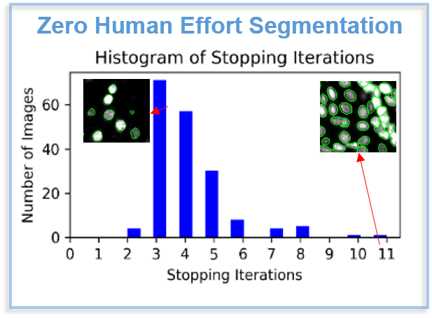
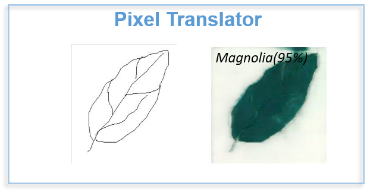

 

# &nbsp;&nbsp;&nbsp;&nbsp;Rebecca Li

&nbsp;&nbsp;&nbsp;&nbsp;&nbsp;&nbsp;  E-mail:   [ Xiaoyang.Rebecca.Li@gmail.com](Xiaoyang.Rebecca.Li@gmail.com)

&nbsp;&nbsp;&nbsp;&nbsp;&nbsp;&nbsp;  LinkedIn:  [Linkedin.com/in/xiaoyang-rebecca-li](https://www.linkedin.com/in/xiaoyang-rebecca-li/?locale=en_US)

&nbsp;&nbsp;&nbsp;&nbsp;&nbsp;&nbsp;  \|  [ ResearchGate](http://researchgate.net/profile/Xiaoyang_Li14) \| [GoogleScholar](https://scholar.google.com/citations?user=k7iInwsAAAAJ&hl=en&authuser=1) \|   [ GitHub](http://github.com/Xiaoyang-Rebecca )  \|  [ CV/Resume](https://drive.google.com/file/d/1GApBS2kuk6vfx0mnKjPG59URymvI3xze/view) \| 

Howdy! I am Rebecca Li, a Ph.D. at University of Houston with 5-yr professional experience of Data Science. I also have published in top-tier AI conferences (NIPS, MICCAI) and domain Journals on Deep Learning, Machine Learning, and Computer Visions. My diverse advanced industrial data scientice domains include Medical Image, Self-driving Car and Oil & Gas. I have greet passion on solving real-world problems. 

PhD Advisor: [Pro.Badri Roysam](http://www.ee.uh.edu/faculty/roysam)

--------------
# SPOTLIGHT PROJECTS

## Professional Projects

## Related Projects
 

 

--------------
# PRESENTATIONS 

-	**X. Rebecca. Li**, B. Roysam,. Van Nguyen, H., “Toward Zero Human Efforts: Iterative Training Framework for Noisy Segmentation Label”, Grace Hopper Celebration, General Poster, 2020 [[Poster]](https://www.researchgate.net/publication/342663998_Toward_Zero_Human_Efforts_Iterative_Training_Framework_for_Noisy_Segmentation_Label "Grace Hopper Celebration Poster")
-	B.Roysam, H. Nguyen, S.Prasad , J,Jahanipour, **X, Li**.  et al. “Brain Tissue Analytics for Accelerating Drug Discovery”, 2019 Rice Data Science Conference [[Abstract]](https://2019datascienceconference.sched.com/speaker/xiaoyang_li.2019apwp)
-	 **X. Rebecca. Li.**, et al.. Generative Inpainting Network Applications on Seismic Image Compression and Non-Uniform Sampling. Workshop on Neural Information Processing Systems (NIPS): Solving Inverse Problems with Deep Networks (2019). [[Poster]](https://www.researchgate.net/publication/342393127_Generative_Inpainting_Network_Applications_On_Seismic_Image_Compression?_sg=NLR-jR1kH68IGpgbIZWBGn_b0EgQeDCJd4v2NqKtkUhztF4yumiDb8Q8pDBBCIoya02jgPwoxpJ7-0PgaAy4_kuyI4OJGvAcpIPhcKMX.1u4TvNJH7fYLPtz5wlzLw8faQN65sw0TkNcnhYTUnxyA2dneET2USKgvHbT3MBGyuNef8YMOYLMRuN_YYBv52w)
-	**X. Rebecca. Li**, “Computer Vision Applications on Nuclei Segmentations”, IEEE- Houston Section General Meeting, Dinner Speech, 2018 [[News Posts]](http://sites.ieee.org/houston/navigating-office-politics-michele-tesciuba/)
-	**X. Li**, K. Grama, J. Jahanipour, B. Roysam, D. Maric, “ Nucleus Segmentation and Computational Analysis of Neuronal Phenotypes in Layers I-VI of the Cerebral Cortex in the Rat Brain” , National Institute of Health, Summer Poster Day, 2017[[Poster]](https://www.researchgate.net/publication/342393076_Computational_Mapping_of_Rat_Brain_Cytoarchitectonics_using_Multiplex_Biomarker_Imaging_and_Quantitative_Analysis?_sg=NLR-jR1kH68IGpgbIZWBGn_b0EgQeDCJd4v2NqKtkUhztF4yumiDb8Q8pDBBCIoya02jgPwoxpJ7-0PgaAy4_kuyI4OJGvAcpIPhcKMX.1u4TvNJH7fYLPtz5wlzLw8faQN65sw0TkNcnhYTUnxyA2dneET2USKgvHbT3MBGyuNef8YMOYLMRuN_YYBv52w)
-	**X. Li,** J. Jahanipour, D. Maric, B. Roysam, “Automatic Nucleus Segmentation of Whole Rat Brain Image”, Mission Connect /TIRR Foundation Annual Scientific Symposium, 2017 [[Poster]](https://www.researchgate.net/publication/342393076_Computational_Mapping_of_Rat_Brain_Cytoarchitectonics_using_Multiplex_Biomarker_Imaging_and_Quantitative_Analysis?_sg=NLR-jR1kH68IGpgbIZWBGn_b0EgQeDCJd4v2NqKtkUhztF4yumiDb8Q8pDBBCIoya02jgPwoxpJ7-0PgaAy4_kuyI4OJGvAcpIPhcKMX.1u4TvNJH7fYLPtz5wlzLw8faQN65sw0TkNcnhYTUnxyA2dneET2USKgvHbT3MBGyuNef8YMOYLMRuN_YYBv52w) **(Winning Poster Award)**
-	**X. Li**, J. Jahanipour, D. Maric, B. Roysam, “Automatic Nucleus Segmentation of Whole Rat Brain Image”, Center for Advanced Computing and Data Science, Oral and Poster Presenter, University of Houston, 2017
-	**X. Li**, K. Grama, B. Roysam, “Spatial Neuronal Neighborhood Relationship Changes in Rat Brain Tissue Following Ischemic Brain Injury “, Graduate Research Conference, University of Houston, 2016
-	**X. Li**,  Bayesian Theory for Classification, Houston Machine Learning Meetup, Presenter , 2016

--------------
# PUBLICATIONS

-	Yuan,P., Mobiny,A., Jahanipour,J. **Li,X.,** et al. "Few Is Enough: Task-Augmented Active Meta-Learning for Brain Cell Classification", Medical Image Computing and Computer Assisted Intervention(MICCAI), 2020 (Accepted)
- [	**Li, X.R.**, Mitsakos, N., Lu, P., Xiao, Y., Zhan, C. and Zhao, X., Generative Inpainting Network Applications on Seismic Image Compression and Non-Uniform Sampling. Workshop on Neural Information Processing Systems (NIPS): Solving Inverse Problems with Deep Networks (2019). ](https://openreview.net/forum?id=Hyleh7hqUH)
-	[**Li, X. R.**, Mitsakos, N., Lu, P., Xiao, Y., & Zhao, X. (2019). Seismic compressive sensing by generative inpainting network: Toward an optimized acquisition survey. The Leading Edge, 38(12), 923-933.](https://library.seg.org/doi/pdf/10.1190/tle38120923.1?casa_token=Bvp7aMZRsGUAAAAA:GVP5gmW5ewKRrR78-zaNeFsP3ZLdAoWdqXKMdJn7aOO7xJwKk4mEUBHbDZqBRGV7BDZx1ZvbUnU)
-	[Yuan, P., Rezvan, A., **Li, X.**, Varadarajan, N. and Van Nguyen, H., 2019. Phasetime: Deep Learning Approach to Detect Nuclei in Time Lapse Phase Images. Journal of clinical medicine, 8(8), p.1159.](https://www.ncbi.nlm.nih.gov/pubmed/31382487)
-	[Zhao X, Lu P, Zhang Y, Chen J, **Li X**. Swell-noise attenuation: A deep learning approach. *The Leading Edge*. 2019 Dec;38(12):934-42. ](https://library.seg.org/doi/full/10.1190/tle38120934.1)
-	[Zhao, X., Lu, P., Zhang, Y., Chen, J., & **Li, X**. (2019). Attenuating Random Noise in Seismic Data by a Deep Learning Approach. arXiv preprint arXiv:1910.12800.](https://arxiv.org/abs/1910.12800)
-	[**Li Xiaoyang,** “A Simplified Normalization Operation for Perfect Reconstruction from a Modified STFT”, In Pros, IEEE 12th International Conference on Signal Processing (ICSP) , 2014, P42-45](https://ieeexplore.ieee.org/document/7014966)
