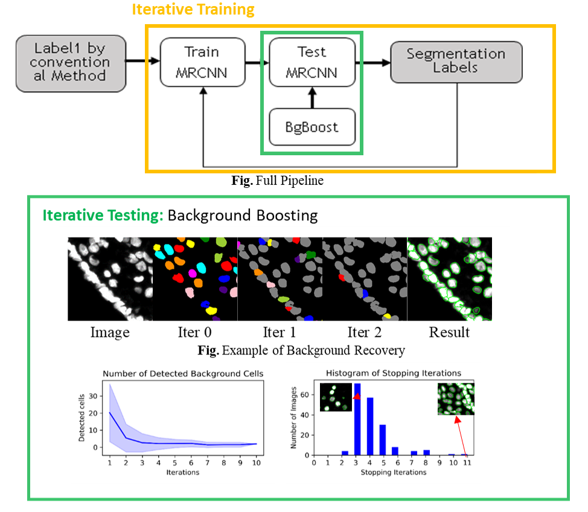

 

- E-mail:   [Xiaoyang.Rebecca.Li@gmail.com](Xiaoyang.Rebecca.Li@gmail.com)                                                             
- LinkedIn: [linkedin.com/in/xiaoyang-rebecca-li](http://linkedin.com/in/xiaoyang-rebecca-li)    
- GitHub: [github.com/Xiaoyang-Rebecca  ](http://github.com/Xiaoyang-Rebecca )                     
- ResearchGate: [researchgate.net/profile/Xiaoyang_Li14](http://github.com/Xiaoyang-Rebecca ) 
--------------

## Welcome to Rebecca's Webpage
Hello, I am a soon-to-graduate Ph.D. at University of Houston with 5yrs of research and industrial experience in Deep Learning, Machine Learning, and Computer Vision. I have published in top-tier AI conferences (NIPS, MICCAI) and Journals. I also have diverse advanced industrial domain experience including Medical Image, Self-driving Car and Oil & Gas. Strong passion for real-world problems and high communication skills.

# Professional Projects

## Zero Human Effort Segmentation 

- Advisors: Badri Roysam, Hien Nguyen
- Abstract: Toward Zero Human Efforts: Iterative Training Framework for Noisy Segmentation Label
In medical image analysis,human annotations are labor-intensive. Most of the well-designed instance segmentation networks are difficult to achieve state-of-the-art performance because medical images lack the high quality of training samples. Thus, we propose an efficient unsupervised learning framework to segment nuclei robustly. We first use an iterative training process to improve segmentation quality without human labels. Then we introduce a background boosting technique to enhance the segmentation accuracy. We achieved high fidelity segmentation especially among crowed objects, and IoU improved by 3% compared to original MRCNN

Datail: [Grace Hopper Celebration 2020 Poster](https://www.researchgate.net/publication/342663998_Toward_Zero_Human_Efforts_Iterative_Training_Framework_for_Noisy_Segmentation_Label "Grace Hopper Celebration Poster")

Language: Python      ;   Framework: Keras 

## Compressive Image Recovery 
	Adapted a pixel inpainting neural network Wasserstein GAN to recover the compressed seismic images 
	Proposed a non-uniform sampling strategy aiming for the optimal design of seismic signal acquisition 
	Achieved reliable recovery from compressed rates of ×2 to ×16; improved MSE 24% and 31% respectively, and performed ×300 faster as compared with conventional approaches
Successfully published in NeulPS Conference Workshop and the Leading Edge Journal

- Mentors:  Nikolaos Mitsakos, Ping Lu
- Abstract: Generative inpainting network applications on seismic image compression
Seismic image acquisition can be time and economic costs. We adopted an appropriately designed Wasserstein generative adversarial network on compressed seismic image recovery. We first trained a pixel inpainting network on several historical surveys, and then propose a non-uniform sampling recommendation based on the evaluation of reconstructed seismic images and metrics. Our results show approximately 300 times faster than the conventional method, and better seismic reconstruction accuracy than the original GAN network.

Detail: [NIPS 2019 Workshop Poster](https://openreview.net/forum?id=Hyleh7hqUH) ,
[The leading Edge Jornal](https://www.researchgate.net/publication/337686701_Seismic_compressive_sensing_by_generative_inpainting_network_Toward_an_optimized_acquisition_survey) 

Language: Python      ;   Framework: Pytorch 

