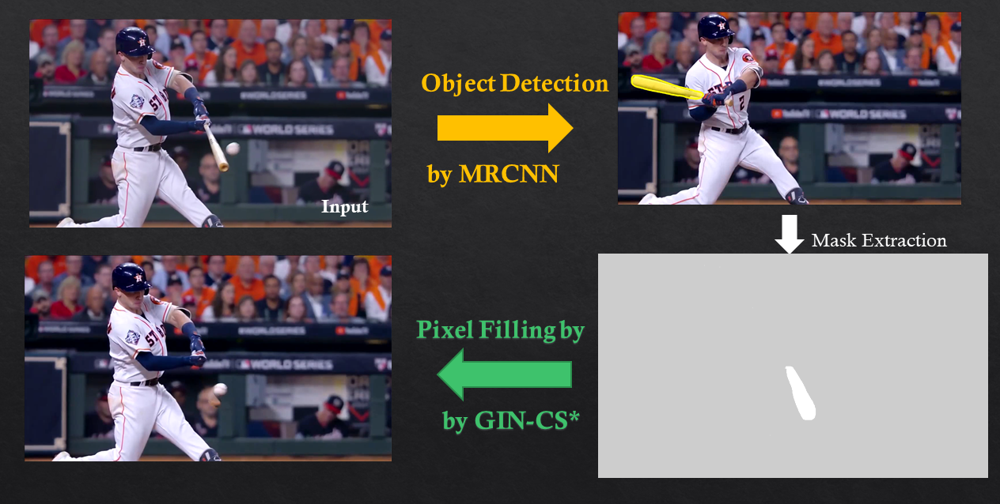

   Hello, I am Rebecca Li, Ph.D. at University of Houston and a experienced Data Scientist. I have published in top-tier AI conferences (NIPS, MICCAI) and Journals on Deep Learning, Machine Learning, and Computer Visions. 
   I also have diverse advanced industrial domain experience including Medical Image, Self-driving Car and Oil & Gas. 

- E-mail:   [Xiaoyang.Rebecca.Li@gmail.com](Xiaoyang.Rebecca.Li@gmail.com)    
- [Resume](https://drive.google.com/file/d/1GApBS2kuk6vfx0mnKjPG59URymvI3xze/view) \|  [LinkedIn](http://linkedin.com/in/xiaoyang-rebecca-li) \| [ ResearchGate](http://researchgate.net/profile/Xiaoyang_Li14) \| [ GitHub](http://github.com/Xiaoyang-Rebecca ) 

--------------
# Professional Projects
--------------
## Zero Human Effort Segmentation 

We innovatively proposed an efficient unsupervised learning framework to segment nuclei robustly without the need of human annotations. We first use an iterative training process to improve segmentation quality without human labels. Then we introduce a background boosting technique to enhance the segmentation accuracy. We achieved high fidelity segmentation especially among crowed objects, and IoU improved by 3% compared to original MRCNN

- Advisors: Badri Roysam, Hien Nguyen
- Datail: [[Grace Hopper Celebration 2020 Poster]](https://www.researchgate.net/publication/342663998_Toward_Zero_Human_Efforts_Iterative_Training_Framework_for_Noisy_Segmentation_Label "Grace Hopper Celebration Poster")
- Language: Python      ;   Framework: Keras 

--------------
## Compressive Image Recovery 

Seismic image acquisition can be time and economic costs. We adopted an appropriately designed Wasserstein generative adversarial network on compressed seismic image recovery. We first trained a pixel inpainting network on several historical surveys, and then propose a non-uniform sampling recommendation based on the evaluation of reconstructed seismic images and metrics. Our results show approximately 300 times faster than the conventional method, and better seismic reconstruction accuracy than the original GAN network.

- Mentors:  Nikolaos Mitsakos, Ping Lu
- Detail: [[NIPS 2019 Workshop Poster]](https://openreview.net/forum?id=Hyleh7hqUH) , [[The leading Edge Jornal]](https://www.researchgate.net/publication/337686701_Seismic_compressive_sensing_by_generative_inpainting_network_Toward_an_optimized_acquisition_survey) 

Language: Python      ;   Framework: Pytorch 

--------------
# [Related Projects]("./related_projects.md")
--------------
## DeepEraser

I designed an object-oriented "eraser" for image and video , which is able to remove the pixels with designated type. MRCNN is used to dected the pixel of a specific types then WGAN is used to remove the detect pixels as they never exist. 
*This is just a prototype use published pretrained weights without any additional training.

- Flow Chart 

- Video 

- [[code]](https://github.com/Xiaoyang-Rebecca/DeepEraser)
