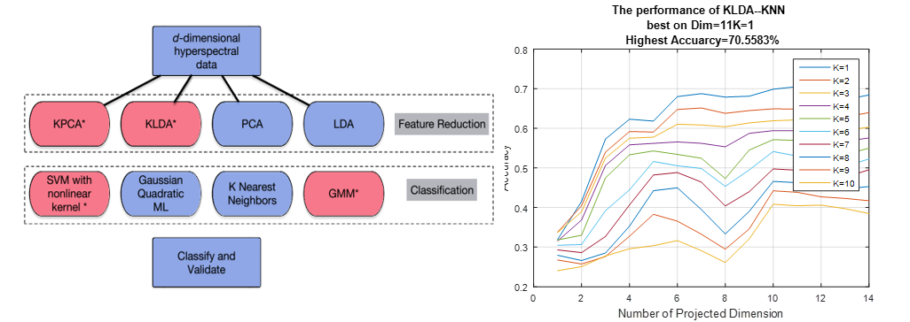

## Feature Reduction to Classifiers
--------------

The case study revealed the influence of 4 common feature redution methods (PCA,LDA and their kernel versions) to 4 diffenrent types of classifier (SVM, ML, KNN, GMM). Our experiments shows that SVM performed the most robust to the increasing of dimensional space, and SVM and LDA are more sensitive to noises.

- [[Report]](https://www.researchgate.net/publication/308927930_Comparison_of_Feature_Reduction_Approaches_and_Classification_Approaches_for_Pattern_Recognition), [[MatlabCode]]("https://github.com/Xiaoyang-Rebecca/PatternRecognition_Matlab")

- Instructor: [Dr. Saurabh Prasad](https://hyperspectral.ee.uh.edu/)

---
<< [Back](../)