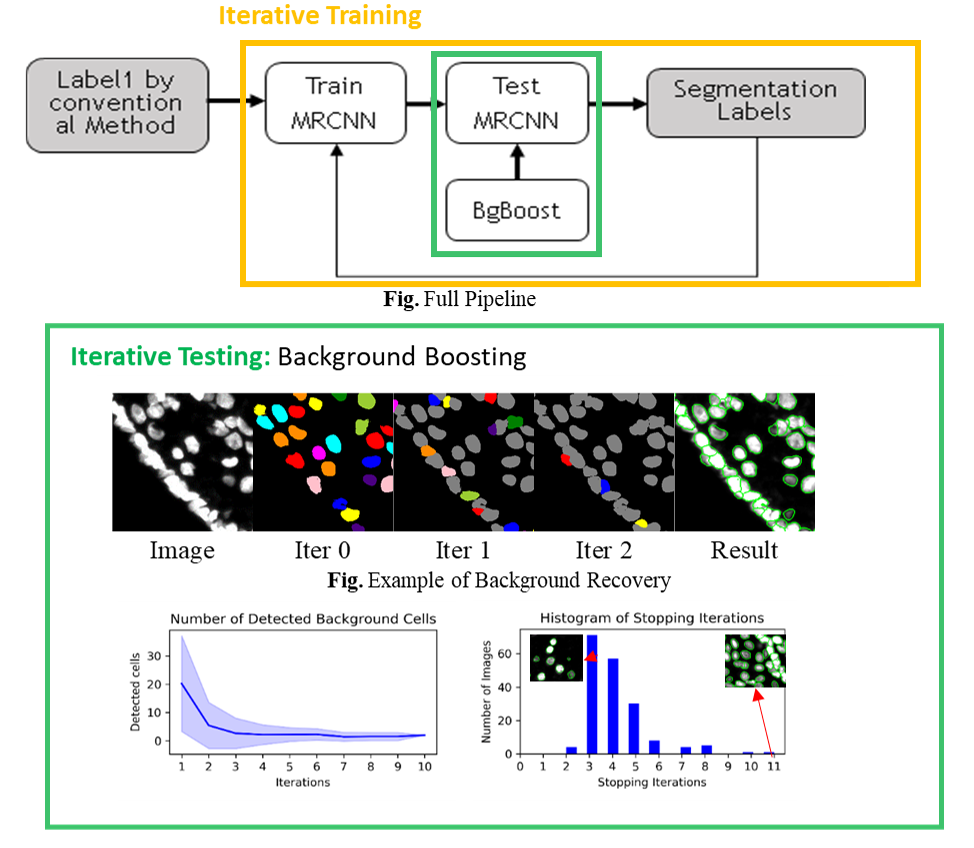

# Zero-human-effort Segmentation 
--------------

We innovatively proposed an efficient unsupervised learning framework to segment nuclei robustly without human annotations. We first use an iterative training process to improve segmentation quality without human labels. Then we introduce a background boosting technique to enhance the segmentation accuracy. We achieved high fidelity segmentation especially among crowed objects, and IoU improved by 3% compared to original MRCNN.

- Advisors: Dr.Badri Roysam, Dr.Hien Nguyen
- Datail: [[Grace Hopper Celebration 2020 Poster]](https://www.researchgate.net/publication/342663998_Toward_Zero_Human_Efforts_Iterative_Training_Framework_for_Noisy_Segmentation_Label "Grace Hopper Celebration Poster"),[[Python]](https://github.com/RoysamLab/whole_brain_analysis) (Keras), partically released

---
 **X. Rebecca. Li**, B. Roysam,. Van Nguyen, H., “Toward Zero Human Efforts: Iterative Training Framework for Noisy Segmentation Label”, Grace Hopper Celebration, General Poster, 2020 

---
<< [Back](../)